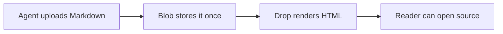

# Publish immutable agent plans

Render uploaded Markdown at its existing Drop URL. Keep the source immutable and available through `?raw`.

> [!NOTE]
> The current upload API already creates anonymous UUIDs. There is no edit endpoint or identity model to add.

## Request flow

## Decisions

| Concern | Decision | Reason |
| --- | --- | --- |
| URL | Keep `/i/<uuid>.md` | Existing clients do not change |
| Updates | Publish a new file | The old URL remains trustworthy |
| Rendering | Comark on the server | Components and Mermaid work without browser JavaScript |

## Delivery

- [x] Render Markdown as HTML
- [x] Keep raw source at `?raw`
- [x] Optimize images before their only storage write
- [ ] Add more purpose-built components after real usage
