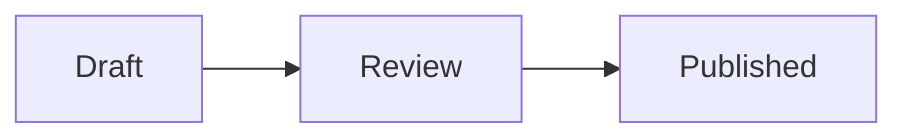

# Writing files for Drop

Create the finished file a human should read or an agent should execute. The file extension already identifies the format. Apply the general writing rules and the relevant format rules below, then upload the final file once.

## Write for the reader

Lead with the outcome, recommendation, or instruction. Keep only context that changes what the reader decides or does.

- Write for the person using the document, not for the agent that produced it.
- Treat a conversational request as input, not as the document outline.
- Resolve obvious shorthand from the named project.
- Verify proposed fixes as hypotheses. Lead with evidence that changes the premise.
- Preserve reasons, constraints, evidence, and meaningful trade-offs.
- Remove research chronology, repeated summaries, generic setup, and work invented to make a proposed solution look necessary.
- Prefer short sections with concrete names.
- Aim for one screen of prose. Write more only when omitted evidence could change the decision.
- Use a table for repeated comparisons and a diagram when relationships are harder to understand in prose.
- End with an unresolved decision or next action only when one exists.

## Agent prompts

A prompt is an executable contract. Spend words only on context and decisions the target agent cannot infer.

Classify its lifespan first:

- A task prompt carries current state toward one result.
- Persistent instructions contain rules that stay useful across requests. Keep temporary state in the task prompt.

When the project is available, inspect its applicable instructions and a representative prompt. Preserve exact project terms, targets, skill names, and authority. Expose assumptions that would change execution.

Keep only the parts that change the work:

- outcome and target
- necessary context and source of truth
- required skills, tools, or capabilities that are actually available
- authority to read, change, publish, or leave something untouched
- observable proof of completion and a stopping condition

Write a task prompt in execution order: outcome and target, current evidence, required capabilities, authority and constraints, then verification and the stopping condition.

Order persistent instructions by identity and audience, evidence and source routing, capabilities, authority, then the answer contract.

Let each named skill own its process. State only the task-specific reason or limit that the skill cannot know. Remove role theatre, copied skill instructions, generic quality requests, duplicated meaning, speculative implementation detail, and empty headings.

The final prompt should be short enough to scan and complete enough to execute without reconstructing the author's intent.

## Skill files

Keep a skill responsible for one job and one trigger family.

- Use `SKILL.md` for purpose, routing, shared constraints, and the instructions every run needs.
- Put conditional procedures, schemas, and substantial examples in references linked from the branch that needs them.
- Write the description in third person. State the capability first, then `Use when` with concrete product, action, and file-type triggers.
- Keep automatic invocation when the trigger is narrow and the skill is useful whenever it appears.
- Set `disable-model-invocation: true` for explicit workflows, expensive work, mutation boundaries, or actions the agent should not infer.
- Refer to another skill only when the target environment guarantees it is available.
- Add a script when deterministic execution prevents agents from rewriting the same logic on each run.
- Preserve one source of truth for each rule. Remove stale examples, duplicated instructions, and generic advice that does not change behavior.

Before publishing, check YAML frontmatter, local links, trigger wording, reference routing, authority limits, and observable stopping conditions.

## HTML documents

Write HTML as a document, not as a landing page.

- Keep the file self-contained and under 512 KB.
- Prefer dense, scannable content over decorative framing or marketing copy.
- Use responsive semantic HTML, inline CSS, and inline SVG.
- Use a small inline script when interaction helps the reader. Keep the behavior inside the file.
- Embed styles, scripts, fonts, and images. External links are fine.
- Keep secrets, private URLs, and local filesystem paths out of published content.
- For UI variants, render the actual styled options, label them `A`, `B`, and `C`, and place them together for comparison.

Keep one local path while drafting. Drop uploads are non-editable, so publish a new URL for each finished revision. Open the document in a browser when the user asks to inspect it.

## Markdown and Comark

Use standard Markdown, GitHub-style tables, task lists, alerts, and the supported Comark syntax. Drop renders Markdown as HTML and escapes raw HTML.

For the full Comark authoring model, find [Comark on skills.sh](https://skills.sh/search?q=comark) or read its official [skill source](https://comark.dev/.well-known/skills/comark/SKILL.md). This Drop reference remains usable when that skill is not installed.

### Alerts

```md
> [!NOTE]
> This explains a constraint that changes the plan.
```

### Mermaid

Use a fenced Mermaid diagram when it makes a relationship or flow easier to read:

````md

````

Prefer one diagram per document. Drop bounds rendering work and shows oversized or invalid diagrams as source text.

### Comark callouts

Use a callout for a named decision or constraint:

```md
::callout{type="decision"}
Keep the existing endpoint.
::
```

Supported callout names are `alert`, `callout`, `info`, `note`, `tip`, and `warning`. Unknown components remain readable but do not receive custom presentation.

### Frontmatter and revisions

Set a title when the first heading is not the document title. Add `supersedes` only when the reader needs a visible revision chain.

```md
---
title: Publish permanent plans
supersedes: https://drop.vitehub.dev/i/previous.md
---
```

Drop does not mutate the previous file or maintain server-side history.

## Remove machine writing

Make the document sound like a person wrote it for this reader.

- State a clear opinion when the work calls for judgment. Use first person when it fits.
- Be specific. Name the mechanism, measurement, person, or source behind a claim.
- Vary sentence length. Split sentences that require rereading.
- Prefer active voice, plain words, and concrete verbs.
- Replace an adverb propping up a weak verb with a stronger verb or a measured fact.
- Cut puffery, promotional language, generic conclusions, and formulaic success stories.
- Name the source of a claim. Remove vague phrases such as "experts believe" when no source exists.
- Remove filler such as "in order to," "it is important to note," and "due to the fact that."
- Replace abstract technical metaphors with the actual mechanism.
- Use one term for one concept instead of cycling through synonyms.
- Use a real scale for a range. Otherwise name the items directly.
- State the point directly instead of using "not just X, but Y."
- Use sentence-case headings, straight quotes, and bold text only when it helps scanning.
- Use colons for lists or examples, not to splice two sentences together.
- Avoid em dashes. End the sentence or rewrite it.
- Remove decorative emoji, forced groups of three, chatbot pleasantries, canned disclaimers, and praise aimed at the user.
- Name uncertainty once and precisely. Several stacked hedges hide the actual claim.

Read the finished file once and ask what makes it look machine-generated. Rewrite those parts. Do not polish away personality, useful tension, or honest complexity.

## Publish once

Check the final source for secrets, private links, local paths, broken references, placeholder text, and duplicated sections. Upload it once. Do not retry a successful upload because another request creates another permanent URL.
