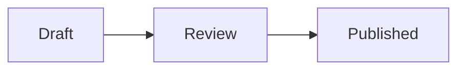

# Human-readable documents

Use this guide directly. It does not require any other writing skills.

Choose the source format before writing:

- Use Markdown for plans, proposals, technical notes, and other text-first documents.
- Use HTML when layout, visual comparison, or custom presentation carries meaning.
- Treat prompts and `SKILL.md` files as agent instructions, even when they use Markdown syntax.

## Agent prompts

A prompt is an executable contract. Spend words only on context and decisions the target agent cannot infer.

First choose its lifespan:

- A task prompt carries current state toward one result.
- Persistent instructions contain rules that remain useful across requests. Keep temporary state out of them.

When the project is available, inspect its instructions and a representative prompt. Preserve exact skill names, project terms, targets, and authority. Expose any assumption that would change execution.

Keep only the outcome, target, necessary context, source of truth, required capabilities, authority, and proof of completion. Omit any item that does not change execution.

Write a task prompt in execution order: outcome and target, current evidence, required capabilities, authority and constraints, then verification and the stopping condition. For persistent instructions, order identity and audience, evidence and source routing, capabilities, authority, then the answer contract.

Name only skills and tools available to the target agent. Let each named skill own its process instead of copying its instructions into the prompt.

Delete role theatre, generic quality requests, duplicated meaning, speculative implementation detail, and headings that contain no useful grouping. The finished prompt must be short enough to scan and complete enough to execute without reconstructing the author's intent.

## Skill files

Keep a skill responsible for one job and one trigger family. Split unrelated jobs instead of building a catch-all.

- Use `SKILL.md` for the decision rules every run needs.
- Put conditional procedures, schemas, and substantial examples in references linked from the branch that needs them.
- Write the description in third person. State the capability first, then `Use when` with concrete product, action, and file-type triggers.
- Keep automatic invocation when the trigger is narrow and the skill is useful whenever it appears. Set `disable-model-invocation: true` for explicit workflows, expensive work, mutation boundaries, or actions the agent should not infer.
- Refer to another skill only when the target environment guarantees it is available.
- Add a script only when deterministic execution avoids repeatedly rewriting the same logic.

Before publishing, check the YAML frontmatter, local links, trigger wording, progressive disclosure, authority limits, and observable stopping conditions. Each remaining instruction should change behavior.

## HTML documents

Write HTML as a document, not a landing page.

- Keep the file self-contained and under 512 KB.
- Prefer dense, scannable content over decorative framing or marketing copy.
- Use responsive semantic HTML, inline CSS, and inline SVG.
- Keep the document useful without JavaScript. Add a small inline script only when interaction helps the reader.
- Embed styles, scripts, fonts, and images. External links are fine.
- Keep secrets, private URLs, and local filesystem paths out of the document.
- For UI variants, render the real styled options, label them `A`, `B`, and `C`, and place them together for comparison.

Drop uploads are non-editable. Finish the document before publishing it, then publish a new URL for each revision.

## Markdown plans

Write for the person deciding or implementing, not for the agent that produced the plan.

Treat a conversational prompt as input, not an outline. Resolve obvious shorthand from the named repository, verify suggested fixes as hypotheses, and lead with evidence that changes the premise. Do not invent work to preserve the requested solution.

### Shape

- Open with the outcome or recommendation.
- Keep only context that changes the decision.
- Preserve reasons, evidence, constraints, and meaningful trade-offs.
- Prefer short sections with concrete names.
- Remove research chronology, repeated summaries, and generic setup prose.
- Aim for one screen of prose. Exceed it only when omitted evidence could change the decision.
- Use a table for repeated comparisons.
- Use at most one Mermaid diagram, and only when it makes a relationship or flow easier to read.
- End with unresolved decisions or the next action when either exists.

### Supported syntax

Use standard Markdown, GitHub-style tables, task lists, and alerts:

```md
> [!NOTE]
> This explains a constraint that changes the plan.
```

Use a fenced Mermaid diagram when it clarifies the plan:

````md

````

Use a Comark callout for a named decision or constraint:

```md
::callout{type="decision"}
Keep the existing endpoint.
::
```

Supported callout names are `alert`, `callout`, `info`, `note`, `tip`, and `warning`. Unknown components render as readable fallback text. Drop escapes raw HTML.

### Frontmatter and revisions

Set a title in frontmatter when the first heading is not the document title:

```md
---
title: Publish permanent plans
supersedes: https://drop.vitehub.dev/i/previous.md
---
```

`supersedes` is an optional link-chain convention. Drop does not mutate the previous file or maintain server-side history.

## Edit the prose

Make the final document sound like a person wrote it for this specific reader.

- Prefer concrete facts, plain words, and active voice.
- Use first person and state a clear opinion when the document calls for judgment.
- Vary sentence length. Split sentences that require rereading.
- Remove puffery, marketing language, vague attribution, and generic conclusions.
- Remove filler such as "in order to," "it is important to note," and "due to the fact that."
- Replace abstract technical metaphors with the actual mechanism.
- Avoid forced groups of three, repeated synonyms, decorative emoji, and excessive bold text.
- Avoid em dashes. Use a period or rewrite the sentence.
- Use sentence-case headings and straight quotes. Use colons for lists or examples, not as a substitute for a sentence.
- State the point directly instead of using "not just X, but Y."
- Name uncertainty precisely. Do not pad it with several hedges.

Read the finished prose once and ask what makes it look machine-generated. Rewrite those parts before publishing.

## Publish once

Check the final source for secrets, private links, local paths, broken references, placeholder text, and duplicated sections. Then upload it once. Do not retry a successful upload because another request creates another permanent URL.
