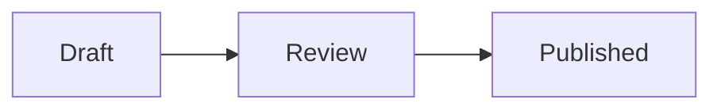

# Human-readable documents

Use this guide directly. It does not require any other writing skills.

Choose the source format before writing:

- Use Markdown for plans, proposals, technical notes, and other text-first documents.
- Use HTML when layout, visual comparison, or custom presentation carries meaning.
- Treat prompts and `SKILL.md` files as agent instructions, even when they use Markdown syntax.

## Prompts and agent instructions

Write the shortest instruction that reliably produces the requested result.

- Put the goal and concrete deliverables first.
- Keep a constraint beside the behavior it controls.
- State what the agent may read, change, publish, or leave untouched when authority matters.
- Replace vague quality requests with checks the agent can observe.
- Remove advice the agent already follows without being told.
- Keep one prompt or skill responsible for one job. Split unrelated jobs instead of building a catch-all.
- Keep the main instructions easy to scan. Move conditional procedures and detailed examples into references.

For a `SKILL.md` description, name both the capability and its trigger. Use concrete nouns such as the product, action, and file type so another agent can decide when to load it.

Before publishing agent instructions, check their YAML frontmatter, local links, trigger wording, safety limits, and stopping conditions.

## HTML documents

Write HTML as a document, not a landing page.

- Keep the file self-contained and under 512 KB.
- Prefer dense, scannable content over decorative framing or marketing copy.
- Use responsive semantic HTML, inline CSS, and inline SVG.
- Keep the document useful without JavaScript. Add a small inline script only when interaction helps the reader.
- Embed styles, scripts, fonts, and images. External links are fine.
- Keep secrets, private URLs, and local filesystem paths out of the document.
- For UI variants, render the real styled options, label them `A`, `B`, and `C`, and place them together for comparison.

Drop uploads are non-editable. Finish the document before publishing it, then publish a new URL for each revision.

## Markdown plans

Write for the person deciding or implementing, not for the agent that produced the plan.

Treat a conversational prompt as input, not an outline. Resolve obvious shorthand from the named repository, verify suggested fixes as hypotheses, and lead with evidence that changes the premise. Do not invent work to preserve the requested solution.

### Shape

- Open with the outcome or recommendation.
- Keep only context that changes the decision.
- Preserve reasons, evidence, constraints, and meaningful trade-offs.
- Prefer short sections with concrete names.
- Remove research chronology, repeated summaries, and generic setup prose.
- Aim for one screen of prose. Exceed it only when omitted evidence could change the decision.
- Use a table for repeated comparisons.
- Use at most one Mermaid diagram, and only when it makes a relationship or flow easier to read.
- End with unresolved decisions or the next action when either exists.

### Supported syntax

Use standard Markdown, GitHub-style tables, task lists, and alerts:

```md
> [!NOTE]
> This explains a constraint that changes the plan.
```

Use a fenced Mermaid diagram when it clarifies the plan:

````md

````

Use a Comark callout for a named decision or constraint:

```md
::callout{type="decision"}
Keep the existing endpoint.
::
```

Supported callout names are `alert`, `callout`, `info`, `note`, `tip`, and `warning`. Unknown components render as readable fallback text. Drop escapes raw HTML.

### Frontmatter and revisions

Set a title in frontmatter when the first heading is not the document title:

```md
---
title: Publish permanent plans
supersedes: https://drop.vitehub.dev/i/previous.md
---
```

`supersedes` is an optional link-chain convention. Drop does not mutate the previous file or maintain server-side history.

## Edit the prose

Make the final document sound like a person wrote it for this specific reader.

- Prefer concrete facts, plain words, and active voice.
- Vary sentence length. Split sentences that require rereading.
- Remove puffery, marketing language, vague attribution, and generic conclusions.
- Remove filler such as "in order to," "it is important to note," and "due to the fact that."
- Replace abstract technical metaphors with the actual mechanism.
- Avoid forced groups of three, repeated synonyms, decorative emoji, and excessive bold text.
- Avoid em dashes. Use a period or rewrite the sentence.
- State the point directly instead of using "not just X, but Y."
- Name uncertainty precisely. Do not pad it with several hedges.

Read the finished prose once and ask what makes it look machine-generated. Rewrite those parts before publishing.

## Publish once

Check the final source for secrets, private links, local paths, broken references, placeholder text, and duplicated sections. Then upload it once. Do not retry a successful upload because another request creates another permanent URL.
