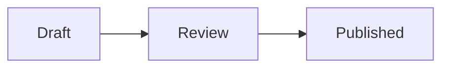

# Markdown plans

Write for the person deciding or implementing, not for the agent that produced the plan.

## Shape

- Open with the outcome or recommendation.
- Keep only context that changes the decision.
- Preserve reasons, evidence, constraints, and meaningful trade-offs.
- Prefer short sections with concrete names. Remove research chronology, repeated summaries, and generic setup prose.
- Aim for one screen of prose. Exceed it only when omitted evidence could change the decision.
- Use a table for repeated comparisons and Mermaid for relationships or flows that are harder to read linearly.
- End with unresolved decisions or the next action, if either exists.

## Supported syntax

Use standard Markdown, GitHub-style tables, task lists, and alerts:

```md
> [!NOTE]
> This explains a constraint that changes the plan.
```

Use fenced Mermaid diagrams when they clarify the plan:

````md

````

Use Comark callouts for a named decision or constraint:

```md
::callout{type="decision"}
Keep the existing endpoint.
::
```

Supported callout names are `alert`, `callout`, `info`, `note`, `tip`, and `warning`. Unknown components render as readable fallback text. Raw HTML is escaped.

## Frontmatter and revisions

Set a title in frontmatter when the first heading is not the document title:

```md
---
title: Publish immutable plans
supersedes: https://drop.vitehub.dev/i/previous.md
---
```

`supersedes` is an optional link-chain convention. Drop does not mutate the previous file or maintain server-side history.
